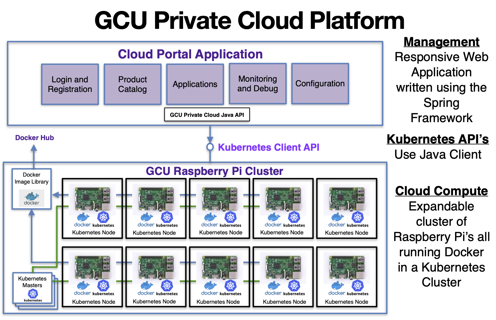

# GCU Cloud Platform - Research Project 2020-2021

Research Question: Can we design and build a fully functioning Private Cloud Platform using a cluster of Raspberry PI’s using current Cloud Technologies?

This repository contains the documentation and code to support the [Cloud Portal Application](https://github.com/markreha/cloudrdp-springboot/blob/master/portal-app/HELP.md) and [Fabric8io Java Kubernetes API](https://github.com/markreha/cloudrdp-springboot/blob/master/java-api/README.md).

You can view the documentation for the project [here](https://github.com/markreha/cloudrdp-springboot/blob/master/docs/README.md). 

	

